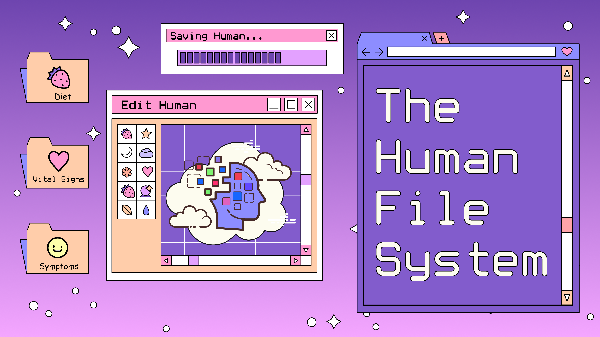

# The Human File System SDK

**A Simple API for Patient-Controlled Health Data Aggregation, Sharing, and Monetization**

The Human File System Collective Superteam DAO is a collective of separate HackFS teams cooperating to accelerating clinical discovery and reduce suffering.

Together, we are creating a set of interoperable software libraries that can be used independently to create user-accesss controlled digital twins on the blockchain.

The libaries can be used independently, but will all be included in the HumanFS SDK.

## ❓ Why in the hell are you doing this?

There are 350k health apps containing various types of symptom and factor data.  However, the isolated data's relatively useless in all these silos. In order to make clinical discoveries, all the factor data needs to be combined with the outcome data.

**Web2 Problem**

The web2 solution to combining all this data is a nightmare of

1. creating thousands of OAuth2 data connectors
2. running a bunch of importer cron jobs on AWS.

**Web3 Solution**

User auth/databases/key management/access control/3rd party OAuth tokens abstracted away by a single, easy-to-use API

i.e.

Pain Tracking App A:

`db.collections.create('Arthritis Severity', timeSeriesData);`

Diet-Tracking App B:

`let timeSeriesData = db.collections.get('Arthritis Severity');`

⇒ Making it possible for Diet-Tracking App B (and/or Pain Tracking App A) to easily analyze the relationship between dietary factors and Arthritis Severity using causal inference predictive model control recurrent neural networks.

## 🌈 Get Involved

Are you or your team working on some aspect of this?
Then join us on [Discord](https://discord.gg/TCrQDsRF) so we can coordinate and avoid duplication of effort.

👨‍🏫 You can also contribute to a task on [DeWork](https://app.dework.xyz/hackfs-dhealth-colle)

## 👩‍💻 Useful resources

- 🤚 [Aragon DAO and Multisig](https://client.aragon.org/?#/humanfs/)
- 💬 [Community on Discord](https://discord.gg/TCrQDsRF)
- 🌎 [EthGlobal HackFS Project](https://ethglobal.com/showcase/human-file-system-mq03o)
- 👨‍🏫 [Tasks on DeWork](https://app.dework.xyz/hackfs-dhealth-colle)

# 📚 Libraries Used

[Data Storage, Authorization and Sharing](https://github.com/yash-deore/sshr-hackfs) - Lit Programmable Key Pairs (PKPs) for access control over protected health information (PHI) with data storage on Ceramic. XMTP (Extensible Message Transport Protocol) is an open protocol and network for secure, private messaging between patients and physicians.

### Libraries TODO
- [Zero Knowledge Unique Patient Identifier Key in a Soul Bound NFT](https://app.dework.xyz/hackfs-dhealth-colle/suggestions?taskId=ff0c50bf-3c11-4076-8c9c-18d8c46ecf05) - For patients, owning an NFT of their medical data would be like creating a sentry to guard that personal information. The NFT would act as a gatekeeper, tracking who requested access, who was granted access, and when—and record all those actions publicly.
- [Federated Learning](https://app.dework.xyz/hackfs-dhealth-colle/suggestions?taskId=f25f12a9-7e3d-4488-85f7-023f95f75dfe) - Fluence to perform decentralized analysis of human generated data from applications and backends on peer-to-peer networks
- [Proof of Humanity](https://app.dework.xyz/hackfs-dhealth-colle/suggestions?taskId=db1092b9-91b4-4352-999a-f088ffefd6c8) - The Proof of Attendance Protocol for Sybil Resistant data collection, ensuring that robots aren't selling fake health data.
- [Reward open-source health innovation](https://app.dework.xyz/hackfs-dhealth-colle/suggestions?taskId=7261a8d8-f1ad-493c-a41c-b70a36507763) - Valist to reward public good open-source health technology innovations using Software License NFTs and proof of open-source contribution.
- [Querying specific health data](https://app.dework.xyz/hackfs-dhealth-colle/suggestions?taskId=3a546a7f-2aa6-43a1-8dda-08c5a62c83b4) - Tableland for querying the HumanFS for specific data types and time periods.
- [NFT Health Data Marketplace](https://app.dework.xyz/hackfs-dhealth-colle/main-space-477/projects/nft-health-data-mark) - NFTPort for minting data sets that can be sold to pharmaceutical companies in a health data marketplace.
- [On-Chain Analytics](https://app.dework.xyz/hackfs-dhealth-colle/suggestions?taskId=0114d499-36ff-4451-9d1a-e870c753e155) - Covalent for Health Data NFT marketplaces, On-Chain Analytics / Dashboards, Health Data Wallets, Health Data Asset tracking, and ROI for NFT generation and sales.
